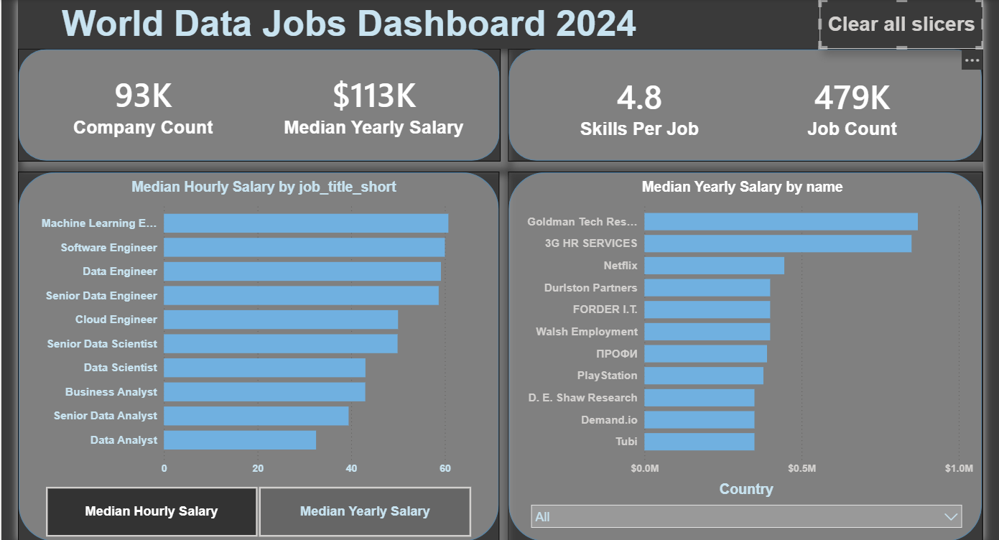

# 🌍 World Data Jobs Dashboard 2024

> *"Data Analysis is not tools… it's a way of thinking."*

---

## 📌 Project Overview

The data job market is full of options — but not all paths lead to the same outcome.

This project started not with Power BI, but with a question:

**"What is the best career path in data, based on salary and real-world benefits?"**

By analyzing **479,000+ job postings** from across the world throughout all of 2024, this dashboard gives job seekers and data professionals a clear, data-driven map of the market — built around decisions, not just charts.

---

## ❓ From Vague to SMART: How the Questions Were Defined

One of the core analytical skills is knowing how to ask the right question before touching any tool.

Instead of asking:
> ❌ *"Which jobs pay more?"*

The project was built around specific, answerable business questions:

| # | SMART Business Question |
|---|------------------------|
| 1 | What are the **top 10 highest-paying companies** for a selected job title? |
| 2 | What are the **top data roles ranked by median salary** — both yearly and hourly? |
| 3 | How many **total job opportunities** exist in the global data market in 2024? |
| 4 | How many **companies** are actively hiring for data roles? |
| 5 | What is the **median annual and hourly salary** across all data roles? |
| 6 | What is the **average number of skills** required per job posting? |

> The "top companies" question was intentionally left open by role — answered dynamically through a **Country slicer**, so the user drives the analysis based on their own context.

---

## 📊 Dashboard



### KPI Cards — The Big Picture at a Glance

| Metric | Value | What It Tells Us |
|--------|-------|-----------------|
| 🏢 Company Count | **93K** | The scale of companies actively hiring in data |
| 💰 Median Yearly Salary | **$113K** | Market benchmark — not skewed by outliers |
| 🛠️ Skills Per Job | **4.8** | Average technical skills required per posting |
| 📋 Job Count | **479K** | Total postings analyzed across 2024 |

### Interactive Visuals

**Left — Median Salary by Job Title**
Ranks all data roles by compensation. A toggle button switches between **Median Hourly** and **Median Yearly** salary views — designed so the user compares roles on their own terms.

**Right — Top Companies by Median Yearly Salary**
Shows the highest-paying companies in the dataset, with a **Country dropdown slicer** to filter by market. The question was built deliberately open at the chart level — the slicer makes it precise.

**Clear All Slicers button**
One-click reset to the full global view — a small UX decision that reduces friction.

> **Design principle applied:** Every element was chosen to reduce **Cognitive Load** — the mental effort required to understand the data. A dashboard full of charts is impressive; a dashboard that answers a question is useful.

---

## 🗂️ Dataset

| Property | Details |
|----------|---------|
| **Source** | YouTube tutorial dataset — used for educational purposes |
| **File** | `job_postings_monthly.xlsx` |
| **Structure** | 12 sheets — one per month (Jan–Dec 2024) |
| **Total Rows** | ~600,000 job postings |

| **Coverage** | Global — United States, Germany, India, UK, Egypt, and more |

| Column | Description |
|--------|-------------|
| `job_title_short` | Standardized job role category |
| `company_name` | Hiring company |
| `job_country` | Country of the posting |
| `salary_year_avg` | Average yearly salary (where available) |
| `salary_hour_avg` | Average hourly salary (where available) |
| `job_work_from_home` | Boolean — remote work offered |
| `job_health_insurance` | Boolean — health insurance offered |
| `job_skills` | List of required technical skills |

---

## 🛠️ Tools Used

| Tool | Purpose |
|------|---------|
| **Power BI Desktop** | Data modeling, DAX measures, dashboard design |
| **Power Query** | Combining 12 monthly sheets, type fixes, data transformation |
| **DAX** | Custom measures for median salary, counts, and skill ratios |

---

## 🧹 Data Preparation Process

Raw data is never analysis-ready. Before any visual was built, the data went through a structured cleaning process:

- ✅ **Removed irrelevant columns** — focused only on fields that serve the business questions
- ✅ **Handled missing salary values** — postings with no salary data excluded from salary measures but retained for count metrics
- ✅ **Fixed data types** — dates, booleans, and numeric fields standardized in Power Query
- ✅ **Standardized formatting** — consistent column naming and value formats across all 12 sheets
- ✅ **Combined monthly sheets** — all 12 sheets merged into a single fact table using Power Query's append feature
- ✅ **Validated results** — spot-checked aggregated outputs against raw data samples to confirm accuracy

> **Why MEDIAN and not AVERAGE?**
> Salary data contains extreme outliers (e.g., $1M+ postings that skew averages heavily). MEDIAN gives a far more representative picture of what the market actually pays.

---

## 🧮 DAX Measures

```dax
-- Median salary across all job postings
-- MEDIAN used over AVERAGE to reduce distortion from high-salary outliers
Median Yearly Salary = 
MEDIAN(job_postings_fact[salary_year_avg])
```

```dax
Median Hourly Salary = 
MEDIAN(job_postings_fact[salary_hour_avg])
```

```dax
-- Each row represents a unique job posting
-- Also used as denominator in per-job ratio calculations
Job Count = 
COUNTROWS(job_postings_fact)
```

```dax
-- Total number of skill entries across all job postings
-- Counts rows from the skills bridge table (each row = one skill linked to one job)
Skill Count = 
COUNTROWS(skills_job_dim)
```

```dax
-- Ratio of total skills to total job postings
-- Gives the average number of skills required per job
-- DIVIDE used instead of (/) to safely handle division by zero
Skills Per Job = 
DIVIDE([Skill Count], [Job Count])
```

```dax
-- Counts unique companies — not total rows — to avoid duplicates
Company Count = 
DISTINCTCOUNT(company_dim[name])
```

---

## 💡 Key Insights

- **Machine Learning Engineer** leads all data roles in median hourly compensation
- **Data Analyst** has the highest job volume — the most accessible entry point into the field
- **Senior roles** show a significant salary jump over mid-level equivalents, making upskilling a high-ROI investment
- The average job posting requires **4.8 skills** — technical breadth matters alongside depth
- Top-paying companies vary dramatically by country — the Country slicer exposes these local market differences

---

## 🧠 Analytical Framework Applied

This project followed the structured data analysis process:

```
Ask → Prepare → Process → Analyze → Share → Act
```

| Phase | What Was Done |
|-------|--------------|
| **Ask** | Defined 6 SMART business questions before opening Power BI |
| **Prepare** | Explored the dataset structure, identified relevant columns, assessed data quality |
| **Process** | Cleaned, combined, and transformed 12 months of raw data using Power Query |
| **Analyze** | Built DAX measures to extract median salaries, job counts, and skill ratios |
| **Share** | Designed a low-Cognitive-Load dashboard with interactive slicers and a toggle view |
| **Act** | Insights are directly usable by anyone navigating a data career path |

---

## 🚀 How to Use

1. Clone or download this repository
2. Open `World_Data_Jobs_Dashboard.pbix` in **Power BI Desktop**
3. The dataset is embedded — no external connection needed
4. Use the **Country slicer** to filter by region
5. Toggle between **Hourly** and **Yearly** salary views using the button selector
6. Click **"Clear all slicers"** to reset to the full global view

---

## 👤 Author

**Mohamed Helal**
Data Analyst | DEPI (Digital Egypt Pioneers Program) Graduate | Agricultural Engineering Background

Domain knowledge matters in data analysis. My engineering background shaped how I approached this project — understanding the *context* of a problem before reaching for any tool.

*Three principles I carry into every analysis:*
- **Less data, better decisions**
- **Insight > Visualization**
- **Context before tools**

[](https://www.linkedin.com/in/mohamed-helal-8b47992a4/)
[](https://github.com/mohamedhelal279-design)

---

*This project is part of a continuous learning journey — applying analytical thinking to real-world data, one business question at a time.*
